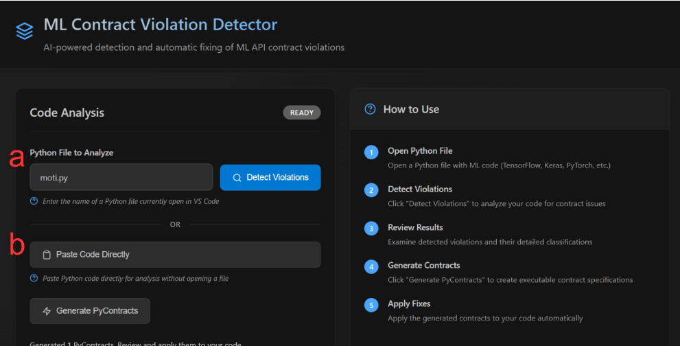
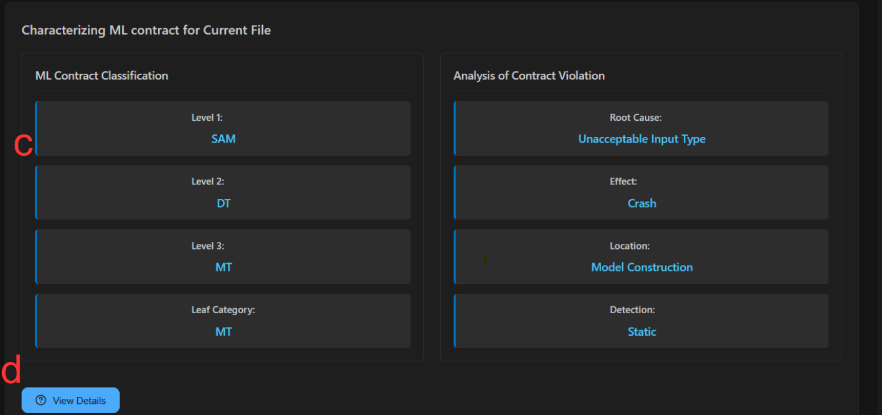
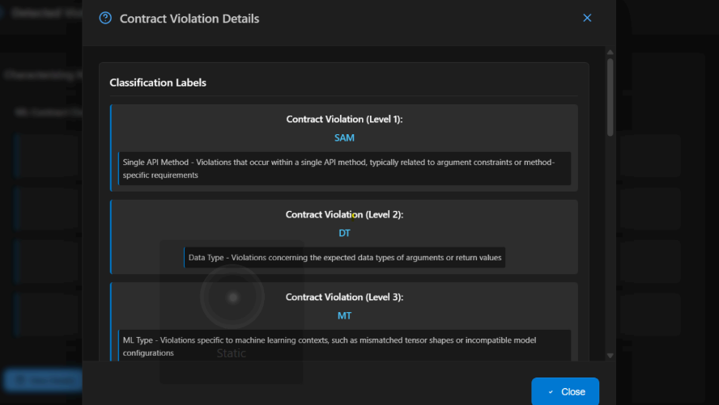
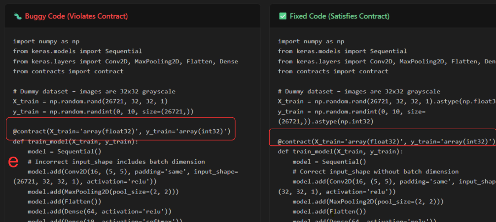
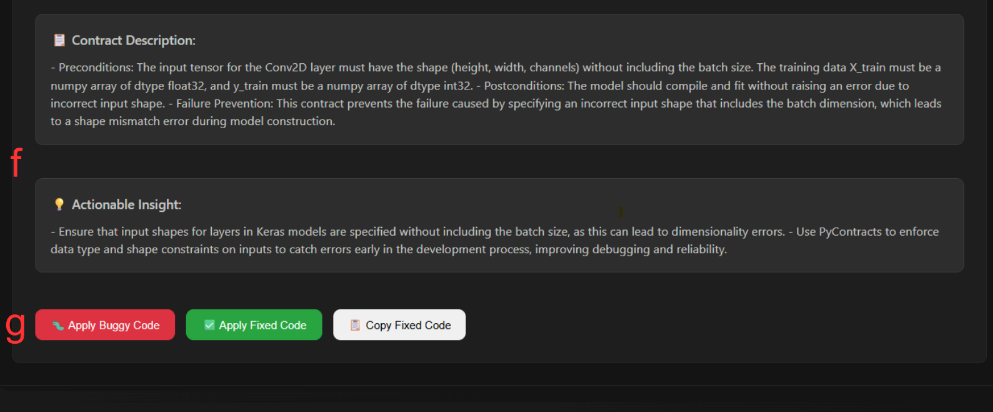

## MLSpecGen Prototype

 *Integrating a RAG-based Approach into a Practical Development Tool for Real-Time ML Contract Violation Detection and Remediation*

To demonstrate the practical applicability of our research methodology, we developed a VS Code extension called **ML Contract Violation Detector** that integrates our RAG-based approach directly into developers’ workflows. The extension provides an interactive dashboard that guides developers through the complete contract detection and generation process, validating that our approach can be effectively deployed in real-world development scenarios.

---

### Extension Interface and Workflow

The VS Code extension provides an interactive dashboard that guides developers through the complete contract detection and generation process. The interface includes multiple components that facilitate the workflow.

*VS Code Extension Interface demonstrating the ML Contract Violation Detector workflow: (a) File-based analysis option, (b) Code paste interface.*

#### Code Input Methods

The extension supports two primary input methods for code analysis:

- **File-based analysis:**  
  Developers can analyze existing Python files by opening them in VS Code and using the **ML Contract: Open Dashboard** command. The extension automatically detects ML library imports and usage patterns.

- **Code paste interface:**  
  Developers can paste code snippets directly into the extension’s dialog box for quick analysis of code from Stack Overflow posts, documentation examples, or experimental code without saving files.

Both input methods trigger the same underlying RAG pipeline, where the code is embedded using the `nomic-embed-text` model and compared against a pre-embedded dataset of violation examples to identify potential contract violations.

---

### Contract Label Generation Process

After code analysis, developers can generate contract violation labels by pressing the **Detect Contract Violations** button. The system processes the code through the RAG pipeline, retrieves the top-5 most similar examples, and applies the hierarchical taxonomy classification.

*Contract Label Generation Interface showing generated labels and the detailed analysis panel.*

#### Generated Labels and Detailed Analysis

The extension displays classification results using a three-level taxonomy:

- **Level 1:** SAM, AMO, Hybrid  
- **Level 2:** DT, BET, G, F, SAI, Selection  
- **Level 3:** PT, BIT, RT, MT, IC-1, IC-2  

The **Details** panel provides comprehensive violation information, including:

- Root cause analysis  
- Predicted effects (crash, incorrect functionality, performance degradation)  
- Violation location within the ML pipeline  
- Detection techniques used  

This detailed presentation provides developers with actionable insights for understanding and addressing contract violations.

---

### Contract Generation and Refinement

The contract generation phase leverages a **dual-prompt architecture** to create executable PyContract specifications.

#### RAG-Enhanced Generation

The system combines retrieved similar examples with research context and PyContracts documentation to generate comprehensive contract specifications. The generation prompt includes:

- Original code  
- Violation classification  
- Context from the embedded dataset  

This ensures generated contracts are grounded in real-world examples and best practices.

#### Automated Feedback Loop

The extension implements an iterative improvement mechanism where generated contracts are validated through execution testing. If a contract fails to reproduce the reported violation, or if the fixed version does not resolve the issue, the system automatically refines the contract using LLM feedback and re-execution. This loop ensures generated contracts are both accurate and practical.

#### Generated Code

The system produces both **buggy** and **fixed** code variants that demonstrate the violation and its resolution. These include:

- Natural-language contract descriptions  
- Executable `@contract` decorators  
- Actionable insights  

Side-by-side comparison helps developers understand the difference between violating and compliant code.

---

### Code Application and Execution

The final step demonstrates practical application of generated contracts through interactive execution.

#### Contract Description and Actionable Insight

The extension provides detailed contract descriptions and actionable insights that explain contract requirements in natural language. This helps developers understand what the contract checks and why it matters, offering educational value beyond technical enforcement.

#### Executing Buggy and Fixed Code

The extension provides buttons to apply and test both buggy and fixed code versions, allowing developers to observe violations and verify that contracts resolve the issue. A persistent Python virtual environment is maintained to ensure dependency and version consistency.

#### Real-Time Output Display

Execution results are displayed in real time, showing error messages for buggy code and successful execution for fixed versions. This immediate feedback demonstrates how contract violations manifest in practice and how generated fixes resolve them.

---

### Practical Impact and Developer Experience

This step-by-step workflow demonstrates how our research methodology translates into a practical developer tool. The extension’s interactive interface, automated feedback loops, and seamless VS Code integration validate the effectiveness of our RAG-based approach in real-world development scenarios.

By providing real-time analysis, automated contract generation, and interactive execution, the extension enables developers to identify and resolve ML contract violations during development, improving code quality and reducing runtime errors in ML applications.
